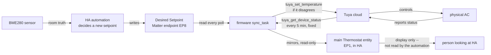

# MiniSplit Control Loop: What Each Layer Does, By Scenario

**Status as of 2026-08-30:** flashed and live. The firmware changes
described here (Desired Setpoint endpoint, read-only main setpoint,
no-rollback sync, fixed poll interval, HTTP timeout + stall self-restart)
are running on the physical device, and the automation has been repointed
to command it through the new endpoint. This document now describes
current reality, not a pending plan -- see "Change history" at the bottom
for what the pre-flash version of this loop looked like and exactly what
changed.

## The division of labor, in one sentence each

- **Firmware** (ESP32, `src/main.c` + `src/matter_device.cpp`): a dumb,
  honest relay between Matter and Tuya's cloud. It has no opinion about what
  the setpoint *should* be -- it relays commands out and mirrors Tuya's real
  state back, on a fixed schedule, with no retry or rollback logic.
- **Automation** ("MiniSplit BME280 predictive setpoint correction", Home
  Assistant): all the actual thinking. Every 10 minutes it looks at the
  BME280 room reading, the day/night target, and how the room has been
  trending, and decides whether the setpoint should move.

Neither layer trusts the other's memory. The automation never assumes a
command it sent actually landed at Tuya; the firmware never tries to guess
what the "right" setpoint is -- it only ever reconciles toward a value
someone else (HA) already decided on.



Note the main Thermostat entity (EP1) only feeds a person looking at the
dashboard now, not the automation itself -- the automation reads its own
room-truth (BME280) and its own last decision (EP8) directly, bypassing
Tuya's mirrored `current_temperature`/setpoint entirely. EP1 is pure
monitoring output at this point, with one exception: `SystemMode` there is
still genuinely writable and still the real mode control.

## What the firmware does

**Matter endpoints it exposes:**

| Endpoint | Purpose | Writable from HA? |
|---|---|---|
| 1: Main Thermostat | Mirrors Tuya: local temperature, setpoint, mode, compressor demand | Mode: yes. Setpoint: **no** (rejected, `ESP_ERR_NOT_SUPPORTED`) |
| 2/3: Aux Temperature / Humidity | BME280 readings | No (sensor) |
| 4: Outdoor Temperature | Tuya's outdoor ambient reading | No (sensor) |
| 5: Compressor Demand (repurposed Humidity) | 0-100% load | No (sensor) |
| 6: Compressor Running (repurposed Occupancy) | on/off | No (sensor) |
| 7: Power (On/Off Plug-in Unit) | True power on/off -- this is the one `tuya_set_power()` listens to, distinct from EP1's own OnOff (see Scenario 6) | Yes |
| 8: Desired Setpoint | HA's clean statement of intent, decoupled from Tuya entirely (no LocalTemperature -- always reports unknown) | Yes -- this is the only setpoint HA should touch now. HA entity: `climate.bedroom_mini_split_ac_bridge_thermostat_8` |

See `TUYA_DP_REFERENCE.md`'s "Matter endpoint layout" section for the full
cluster/attribute-level mapping.

**Background tasks:**

- `sync_task` -- polls Tuya every 5 minutes (fixed, no longer adaptive).
  Applies whatever Tuya reports directly to the mirrors above, then
  separately checks: does the Desired Setpoint endpoint's value (in whole
  Fahrenheit degrees) match what Tuya just reported? If not, sends
  `tuya_set_temperature()` to nudge it. No pending/expectation state --
  if that attempt doesn't stick either, the very next poll notices again
  and tries again. This is the entire "retry" mechanism: a plain,
  unconditional check on every cycle, not a special-cased one. The actual
  Tuya HTTP call now has an explicit 10s timeout (`TUYA_HTTP_TIMEOUT_MS`,
  `tuya_client.c`, added 2026-08-30) -- previously unbounded, and confirmed
  on real hardware to be able to hang this task indefinitely (44+ minutes,
  no self-recovery) while every other task kept running normally, since
  nothing else shares that blocking call.
- `command_task` -- checks every 5 seconds for a pending OnOff or SystemMode
  command from Matter and relays it to Tuya. On failure, logs it and moves
  on -- no revert, no retry.
- `env_task` -- reads the BME280 every 30 seconds, sanity-checks it against
  physically-implausible spikes (corrupted I2C reads), publishes to the aux
  sensor endpoints.
- `health_task` -- logs uptime/heap/failure counters every 60 seconds, and
  as of 2026-08-30 also self-restarts (`esp_restart()`) if `sync_task`
  hasn't completed a successful poll in 20 minutes (`SYNC_STALL_RESTART_MS`)
  -- the automated version of the physical power-cycle that was the only
  fix for the hang above before this existed. Deliberately not routed
  through ESP-IDF's Task Watchdog Timer: that's shared with idle-task-
  starvation detection and tuned for a short default timeout, so
  subscribing a task that legitimately sleeps 5 minutes at a time would
  either trip constantly or require retuning the *global* timeout for
  every other watched task too.

**Removed 2026-08-26/27** (used to live here, now gone entirely):
`g_expected_setpoint`/`_mode`/`_power`, `revert_from_last_status_if_available()`,
the confirmation-patch-and-2-minute-timeout logic in `sync_task`, and the
adaptive fast/slow poll interval.

## What the automation does

- **Trigger:** every 10 minutes.
- **Guard:** only runs if the compressor's on/off state has been stable for
  5+ minutes (anti-short-cycle).
- **Reads:** BME280 corrected temperature, its trend (°F/hour), the external
  day/night ramp target, its own last decision (the Desired Setpoint Matter
  entity's `temperature` attribute, `climate.bedroom_mini_split_ac_bridge_thermostat_8`
  as of 2026-08-30 -- previously a standalone `input_number` that stood in
  for it before the endpoint existed, now retired), its own adaptive gain
  and last-correction-sign, and how long the trend has held its current
  sign without reversing.
- **Computes** the exact number that ends up in the `climate.set_temperature`
  call, in this order (variable names match the automation's own YAML):

  ```
  error            = bme280_now - target_temp
  projected_error  = error + trend_per_hour * (lag_minutes / 60)      # lag_minutes = 16, fixed
  outdoor_factor   = clamp((outdoor_temp - 75) / 20, 0, 1)            # currently always 0, see note below
  gain             = adaptive_gain * (1 + outdoor_factor)
  correction       = gain * projected_error
  raw_setpoint     = clamp(current_setpoint - correction, 60, 75)     # current_setpoint = its own last decision
  new_setpoint     = round(current_setpoint + clamp(raw_setpoint - current_setpoint, -1, 4))
  ```

  `new_setpoint` -- that last line, rounded to a whole degree -- is the
  literal value sent as `climate.set_temperature`'s `temperature:` field.
  Nothing further happens to it between this calculation and the real
  command going out.

  Two guards decide *whether* to act on it at all, checked before the
  command is sent: the move must be upward (backing off) **or** compressor
  demand must have held steady for 3+ minutes; and the move's size must
  clear a minimum -- 1°F normally, relaxed to 0.5°F once the trend has held
  one direction, unreversed, for 40+ minutes (see Scenario 5). If either
  guard fails, `new_setpoint` is discarded and nothing is sent this cycle.

  The second guard (`abs(new_setpoint - current_setpoint) >= min_move`) is
  worth calling out on its own: since `new_setpoint` is computed as a delta
  *from* `current_setpoint` -- which is nothing but the Desired Setpoint
  entity's current `temperature` value, read at the top of the run -- this
  single check is doing two jobs at once. It's both "is this move big
  enough to bother with" *and*, implicitly, "does this differ at all from
  what I last decided" -- there's no separate dedup step. If it fails,
  nothing is sent this cycle at all.

  Note: `outdoor_factor` is permanently 0 right now because
  `sensor.mini_split_ac_bridge_outdoor_temperature` doesn't exist as an
  entity (a pre-existing bug, not introduced by this redesign) -- the
  "boost gain on hot days" behavior it's meant to enable has never actually
  activated. Left as-is per an explicit decision on 2026-08-27.
- **Writes:** one action, every cycle it decides to act -- `climate.set_temperature`
  targeting `climate.bedroom_mini_split_ac_bridge_thermostat_8` (the Desired
  Setpoint Matter entity). That single write serves as both the command
  and the automation's own record of "what did I last decide" for next
  cycle's `current_setpoint` read -- no separate bookkeeping write needed,
  since the entity's own attribute *is* the record now. Before 2026-08-30
  this was two separate actions (a real command to the then-writable main
  entity, plus a parallel write to a standalone `input_number` for clean
  math) -- collapsed into one once the dedicated endpoint existed to do
  both jobs at once.

  It also updates its gain/sign trackers for the next cycle. The real
  command doesn't reach the AC instantly the way it used to pre-flash --
  the firmware's `sync_task` picks up the new Desired Setpoint value on its
  own 5-minute poll schedule and reconciles it against Tuya then, not the
  moment HA's write lands.

## Scenarios

### 1. Normal correction: room drifts above target

Room (BME280) reads 75.5°F against a 74°F day-target, trending up.

1. **Automation** computes a positive error and projected error, turns that
   into a downward setpoint move (more cooling, say 72 → 71), checks the
   guards, and -- assuming they pass -- calls
   `climate.set_temperature(71)` targeting the Desired Setpoint entity.
   That single write is both the command and the automation's own record
   of its decision for next cycle.
2. **Firmware:** on its next poll (within 5 minutes), `sync_task` sees the
   Desired Setpoint endpoint now says 71 while Tuya still reports 72, and
   sends `tuya_set_temperature(71)` itself. This is the only path that
   actually reaches Tuya -- the automation's write in step 1 only ever
   touches the Desired Setpoint entity, never Tuya directly.
3. Tuya applies it (or doesn't -- see Scenario 2 either way). The *next*
   poll after that mirrors whatever Tuya now actually reports into the
   main Thermostat's read-only setpoint, which is what HA's dashboard shows
   -- purely for display, the automation doesn't read it back.

### 2. A command doesn't stick

The automation asked for 70°F. Tuya's cloud is slow, or silently rejects it.

1. **Firmware:** the next poll (5 minutes later) sees Tuya hasn't converged
   to 70. There is no special retry logic -- but because the desired-vs-actual
   check runs unconditionally on *every* poll, it fires the same
   `tuya_set_temperature(70)` again as a normal side effect of the regular
   cycle. This repeats every 5 minutes for as long as the mismatch persists.
2. **Automation:** on its own next 10-minute cycle, it reads
   `current_setpoint` from the Desired Setpoint entity's `temperature`
   attribute -- which still says 70, the automation's own last decision,
   regardless of whether Tuya ever actually confirmed it. Its math for the
   *next* correction is computed from that clean, unaffected baseline, not
   from whatever Tuya's confirmation status happens to be.

### 3. Manual override via the physical remote or Tuya app

Someone changes the setpoint directly to 68°F, bypassing Home Assistant.

1. **Firmware:** the next poll sees Tuya now reports 68 and mirrors that
   into the read-only main entity -- HA's dashboard briefly shows 68. But
   the reconciliation check *also* runs: Desired Setpoint still says
   whatever the automation last decided (say 72), so it sends
   `tuya_set_temperature(72)` right back.
2. **Net effect:** a manual change gets overwritten within one poll cycle
   (≤ 5 minutes) unless the automation's own desired value is also updated
   to match. This is a real, possibly-surprising behavior worth knowing
   about -- the loop actively defends its last decision, it doesn't just
   passively display whatever Tuya has.

### 4. A reboot (either side)

**ESP32 reboots** (firmware update, power blip): boots with the on/off
default set to *true* (not false, changed 2026-08-27) specifically so HA
doesn't show a misleading "the AC turned itself off" flash during the few
seconds before the first real Tuya poll lands. That first poll happens
almost immediately after boot (skips the normal wait), so the true state is
known and mirrored within seconds either way -- the default only affects
what's shown in that brief gap, never a real command sent to Tuya.

**Home Assistant reboots:** the predictive automation now carries
`initial_state: true` (added 2026-08-30), guaranteeing it comes back on
after any restart -- it's the intended always-on controller, unlike the
cascade automation (a deliberately-disabled reference baseline, which
should stay whatever a person last set it to and has no `initial_state`).
This reverses the 2026-08-26 reasoning that removed `initial_state` in the
first place (it re-asserts on *every* restart, not just the first, which
back then meant a stale `false` silently re-disabled the automation after
an unrelated restart) -- `true` doesn't have that failure mode, only
`false` does, so it's safe here specifically because the desired outcome
("always on") matches what it forces every time. Found necessary after the
2026-08-30 firmware flash's restart left the automation off with nothing
in the logs explaining why, and no `initial_state` to blame -- restoring
whatever it last was is HA's own default without one, so once something
switched it off, it silently stayed off across the following restart too.

The Desired Setpoint Matter entity's value persists across HA restarts the
same way any Matter attribute does (it lives on the ESP32, not in HA), so
it survives independently of `input_number.minisplit_desired_setpoint`
(retired 2026-08-30, see "Change history") ever having existed.

### 5. A sustained trend earns a relaxed threshold

The room's temperature trend flips from falling to rising.

1. The automation records the new sign and resets a "since" timestamp
   (`input_datetime.minisplit_trend_sign_since`).
2. Every cycle after that, as long as the trend doesn't flip back, the
   elapsed time since that reset keeps growing.
3. Once it passes 40 minutes, the minimum move required to act relaxes from
   1°F to 0.5°F -- a real, sustained trend that keeps computing a
   sub-1-degree correction can no longer get silently dropped cycle after
   cycle. If the trend reverses before 40 minutes, it never earns the
   relaxed threshold, so a single noisy blip doesn't get treated as real.
4. This exists because of a traced 2026-08-26 incident where the trend
   turned unambiguously positive at 5:06am but no correction landed until
   5:40am, purely because every intervening cycle's correction rounded to
   under the (then-fixed) 1-degree threshold.

### 6. Turning the unit "off" from Home Assistant

There are two different "off" controls, and they do different things:

- **The Thermostat's Cool/Off mode** does *not* power the unit down. It
  switches Tuya to fan mode and opens the fresh-air valve, keeping the
  blower running -- `g_mode_off_via_fan_proxy` remembers this so HA still
  displays "Off" even though the physical unit is technically idling in fan
  mode, not powered down.
- **The dedicated Power switch** (EP7, `switch.bedroom_mini_split_ac_bridge`,
  added 2026-08-30 -- "On/Off Plug-in Unit") really does call
  `tuya_set_power(false)` and shuts the unit down.

Both paths go through the same simplified command_task now: send the
command, log a failure if it happens, and let the next poll show reality --
no revert, no expectation tracking, on either path.

## Change history

| | Before 2026-08-30 | After 2026-08-30 (current) |
|---|---|---|
| Real command destination | `climate.set_temperature` on the main entity | `climate.set_temperature` on the Desired Setpoint Matter entity (`climate.bedroom_mini_split_ac_bridge_thermostat_8`) |
| Main entity's setpoint | Still writable (though nothing should write it) | Genuinely rejected as read-only |
| Who reconciles desired vs. actual | Only the automation, once per 10-minute cycle | Firmware's `sync_task`, every 5 minutes, *and* the automation |
| Automation's "what did I last decide" record | `input_number.minisplit_desired_setpoint` | The Desired Setpoint entity's own `temperature` attribute -- the standalone `input_number` was retired the same day, now unused by anything |
| Tuya HTTP call timeout | None -- confirmed able to hang `sync_task` indefinitely (44+ min, no self-recovery) | 10s (`TUYA_HTTP_TIMEOUT_MS`) |
| Stalled `sync_task` recovery | Only a physical power cycle | `health_task` self-restarts after 20 minutes with no successful poll |
| Predictive automation `initial_state` | Not set (restores whatever it last was) | `true` -- found switched off with no explanation after the flash's restart; see Scenario 4 |

The flash itself (build, serial flash over COM4, boot confirmation) and the
automation's endpoint-repointing edit both happened the same day, in the
same session that wrote this update -- see git history / session notes for
the full sequence if the "why" behind any single row here needs more
context than this table gives.
