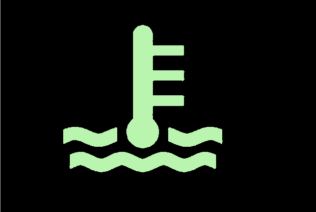
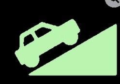
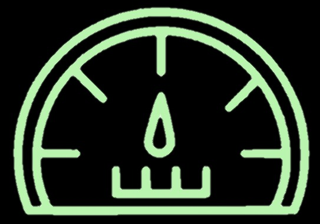

# Requirements / Components
- V2.0.9 of the ESP32 Arduino Core  (https://github.com/espressif/arduino-esp32/releases)  V1.6 was very undstable when using I2C.
- FireBeetle ESP32 board  (https://www.dfrobot.com/product-1590.htm)
- Longan Canbed Dual board (https://docs.longan-labs.cc/1030019/)
- LCD screen (I'm using SK-pixxiLCD-39P4-CTP from 4D Systems)
- Pressure sensor for altitude and MAF.  (I'm using MPL3115A2 from Adafruit)
- Differential pressure sensor for pitot. (I'm using P1J-12.5MB-AX16PA https://www.sensata.com/products/pressure-sensors-switches/p1j-low-pressure-sensor-125-mbar-i2c-p1j-125mb-ax16pa)
- Real Time Clock (I'm using PCF8523 from Adafruit)

# Screens

#### Main Screen
-  This button goes to the "trip summary forms" which are explained later.
-  This gauge takes the current vehicle speed and subtracts the wind speed, as measured by the pitot and differential sensor.  The difference is the head/tail wind.
-  This radial gauge shows the transmission temperature.
-  This radial gauge shows the coolant temperature.
-  This radial gauge shows the calculated load from ECU.
-  This radial gauge shows turbo boost.
-  Digits show either real-time MPG, or average.  When early in the trip, it'll be real-time until there's enough miles driven to have a useful average.
-  Digits show miles left at the *current* instant MPG number.  (not average)
-  Current Elevation
-  Digits show time elapsed in tenths of an hour *since last stop*.  e.g. .5 is 30 minutes.
-  Digits show miles driven *since last stop*.  For other mile totals, see trip summary forms.

### Summary Forms
- There are three summary forms which show additional data: 1) Since last stop, 2) Current segment, and 3) Entire trip.
    - **Since Last Stop**: Is an expanded view of the main screen with data only since the last stop.  Stops are automatically calculated based on ignition on/off.
    - **Current Segment**: Shows information for the current segment.  New segments are created manually.  (see later in this doc)  If no new segment is created, the numbers will match full trip data.
    - **Full Trip**: The information will keep on aggregating until the user manually creates a new trip.  (keep reading to find out how to do this)
-  This button cycles through the three different summary screens.
-  Always goes to the main screen.
-  This button goes to the the menu 

### Menu Form
- **Start New Trip**: Zeros out all data (including calibration factors) and gives a fresh start for a brand new trip.
- **Start Segment**: Starts a brand new segment.  This is often useful for tracking days in a multi-day trip.  Also, if you're stopping off somewhere to visit, perhaps you want a new segment for that.
- **Debug**: Does two things: 1) Tries to connect to Wifi if originally unable to on start, and 2) Dumps Trip Segments, Current Data, and the Property Bag to logs.  (see log section on more info)
- **Calib Pitot**: Creates a ratio of vehicle speed and wind speed which is then used to adjust the wind speed.  The implication is that this action is best done when a) you're going over 50mph, and b) there's no wind.  This value *does* persist until a new trip is created.

### Stopped Form
- This form is shown automatically every time the ignition is turned off.  In addition, all persistent data is saved to the EEPROM at this time.
- The power is automatically turned off 30 seconds after the ignition is turned off.

### Starting Form
- This form is automatically shown after boot/validation sequence is completed upon vehicle start.
- There is opportunity here to start a new trip or a new segment.  (see Summary Forms section for more info on what these mean)
- If nothing is pressed, the main screen will be activated after going 5 MPH.

# Technical Notes:

### Overall software topology
- 'CanCapture.ino' is loaded onto the CanDual board and requests and listens for specific PIDs.  These PIDs are then sent via serial to the main ESP32 board driving the screen.
- 'TripDisplay.ino' is what runs on the ESP32 board, listens for incoming PIDs, and then drives the LCD screen with the info.

### Overall hardware topology
- There are two "boxes".  One is the power supply which switches power based on ignition presence, and provides a stable 5V for the processors. The other contains the sensors, ESP32, CanDual, and interconnections.
- Pitot is mounted on the front of the van, and static air is in the engine compartment.

### Important classes
- **CurrentData** holds the live data from both the ECU and sensors.  It does no aggregation and very little calculation.
- **Sensors** is used by CurrentData
- **TripData** has three instances - since last stop, current segment, full trip.  Calculations are done on an as-needed basis when requested.
- **Digits,Forms,Gauge,etc** are used to keep state and drive the LCD screen.
- **Logger** uses **PapertrailLogger** to log to the paper trails for remote viewing of the logs.  Does require internet.

### Other Notes:
- The ESP32 is currently setup to accept OTA software updates if on the same wifi network.

## Paper Trails Logging
- Current URL is https://my.papertrailapp.com/systems/tripdisplay/events to see logging events 
- Sadly, these values are hard coded.....