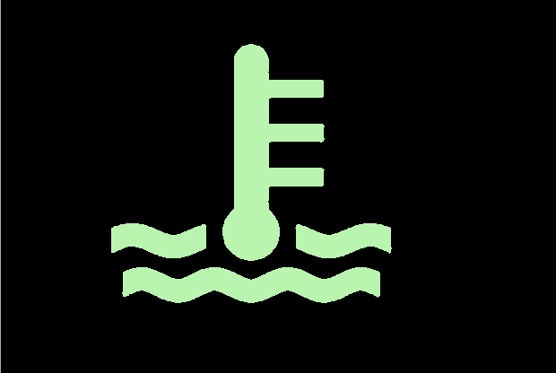

# Requirements / Components
- ESP32 Arduino Core **V3.x** (tested with 3.3.x).  V1.6 was unstable with I2C.  V2.x also works (tested through 2.0.17).  Serial2 pins are set explicitly in code to avoid the 3.x default-pin change.
    - ESP lives here when installed by the IDE: C:\Users\mark\AppData\Local\Arduino15\packages
    - Uses **no_ota** partition scheme (2MB APP / 2MB SPIFFS) since OTA is not used.  Compile with:
      ```
      arduino-cli compile --fqbn esp32:esp32:firebeetle32 --build-property "build.partitions=no_ota" --build-property "upload.maximum_size=2097152" TripDisplay.ino
      ```
- FireBeetle ESP32 board.  Note that the board name is 'FireBeetle-ESP32 (esp32)' 
- Longan Canbed Dual board (https://docs.longan-labs.cc/1030019/)
- LCD screen (I'm using SK-pixxiLCD-39P4-CTP from 4D Systems)
- Pressure sensor for altitude and MAF.  (I'm using MPL3115A2 from Adafruit)
- Differential pressure sensor for pitot. (I'm using P1J-12.5MB-AX16PA https://www.sensata.com/products/pressure-sensors-switches/p1j-low-pressure-sensor-125-mbar-i2c-p1j-125mb-ax16pa)
- Real Time Clock (I'm using PCF8523 from Adafruit)
- GPS module for position tracking (Adafruit PA1010D / MTK3333, I2C at 0x10)

### Arduino Libraries Required
| Library | Used By | Install Via |
|---------|---------|-------------|
| `Adafruit MPL3115A2` | Barometer/altimeter | Library Manager |
| `RTClib` | PCF8523 real-time clock | Library Manager |
| `genieArduino` | 4D Systems LCD | Library Manager |
| `ArduinoJson` | WiFi server responses | Library Manager |
| `Adafruit GPS Library` | PA1010D GPS module | Library Manager |
| `LittleFS` | Track file storage | Built into ESP32 core |

# Screens

#### Main Screen
-  This button goes to the "trip summary forms" which are explained later.
-  This gauge takes the current vehicle speed and subtracts the wind speed, as measured by the pitot and differential sensor.  The difference is the head/tail wind.
-  This radial gauge shows the transmission temperature.
-  This radial gauge shows the coolant temperature.
-  This radial gauge shows the calculated load from ECU.
-  This radial gauge shows turbo boost.
-  Digits show either real-time MPG, or average.  When early in the trip, it'll be real-time until there's enough miles driven to have a useful average.
-  Digits show miles left at the *current* instant MPG number.  (not average)
-  Current Elevation
-  Digits show time elapsed in tenths of an hour *since last stop*.  e.g. .5 is 30 minutes.
-  Digits show miles driven *since last stop*.  For other mile totals, see trip summary forms.

### Summary Forms
- There are three summary forms which show additional data: 1) Since last stop, 2) Current segment, and 3) Entire trip.
    - **Since Last Stop**: Is an expanded view of the main screen with data only since the last stop.  Stops are automatically calculated based on ignition on/off.
    - **Current Segment**: Shows information for the current segment.  New segments are created manually.  (see later in this doc)  If no new segment is created, the numbers will match full trip data.
    - **Full Trip**: The information will keep on aggregating until the user manually creates a new trip.  (keep reading to find out how to do this)
-  This button cycles through the three different summary screens.
-  Always goes to the main screen.
-  This button goes to the the menu 

### Menu Form
- **Start New Trip**: Zeros out all data (including calibration factors) and gives a fresh start for a brand new trip.
- **Start Segment**: Starts a brand new segment.  This is often useful for tracking days in a multi-day trip.  Also, if you're stopping off somewhere to visit, perhaps you want a new segment for that.
- **Debug**: Does two things: 1) Tries to connect to Wifi if originally unable to on start, and 2) Dumps Trip Segments, Current Data, and the Property Bag to logs.  (see log section on more info)
- **Calib Pitot**: Creates a ratio of vehicle speed and wind speed which is then used to adjust the wind speed.  The implication is that this action is best done when a) you're going over 50mph, and b) there's no wind.  This value *does* persist until a new trip is created.

### Stopped Form
- This form is shown automatically every time the ignition is turned off.  In addition, all persistent data is saved to the EEPROM at this time.
- The power is automatically turned off 30 seconds after the ignition is turned off.

### Starting Form
- This form is automatically shown after boot/validation sequence is completed upon vehicle start.
- There is opportunity here to start a new trip or a new segment.  (see Summary Forms section for more info on what these mean)
- If nothing is pressed, the main screen will be activated after going 5 MPH.

# Technical Notes:

### Overall software topology
- 'CanCapture.ino' is loaded onto the CanDual board and requests and listens for specific PIDs.  These PIDs are then sent via serial to the main ESP32 board driving the screen.
- 'TripDisplay.ino' is what runs on the ESP32 board, listens for incoming PIDs, and then drives the LCD screen with the info.

### Overall hardware topology
- There are two "boxes".  One is the power supply which switches power based on ignition presence, and provides a stable 5V for the processors. The other contains the sensors, ESP32, CanDual, and interconnections.
- Pitot is mounted on the front of the van, and static air is in the engine compartment.

### RTC Behavior (PCF8523)
The PCF8523 real-time clock starts at its default epoch (Jan 1, 2000, 00:00:00) on first power-up, and is then **synced to real time from GPS** once a satellite fix is obtained.

- **On first power-up** (or after battery loss), the RTC `adjust()` method is called with a default `DateTime()` — which is Jan 1, 2000 00:00:00, i.e. `secondsSince2000 = 0`.  The RTC then counts up from zero until GPS provides real time.
- **GPS time sync** (one-time per boot): Once the GPS module gets a valid fix with a plausible date (`gps.year > 0`), the RTC is set to GPS time via `currentData.setTime()`.  This is a one-time operation — the `rtcSyncedFromGPS` flag prevents subsequent updates.
- **Trip time preservation**: When the RTC jumps from epoch-0 to real time (potentially ~26 years forward), all active `TripData` instances have their `startSeconds` and `ignOffSeconds` adjusted so that elapsed durations are preserved.  For example, if a trip started 30 seconds before the sync, `startSeconds` is shifted so that `newTime - startSeconds` still equals 30.
- **`currentData.currentSeconds`** holds the raw RTC value (seconds since Jan 1, 2000).  After GPS sync, this is real wall-clock time.  Before sync, it's a monotonic counter from zero.
- **Sanity checks**: `getSecondsSinc2000()` guards against the RTC jumping backwards or more than 1 hour forward in a single read — if that happens, it resets the RTC to the last known good value and logs an error.  The GPS sync bypasses this guard by calling `setTime()` directly (which calls `rtc.adjust()`) rather than going through the polling path.
- **Traccar uploads omit the timestamp**: The `&timestamp=` parameter was removed from the OsmAnd URL.  Traccar uses its own server time instead.  This avoids the problem where Traccar silently drops positions with timestamps older than existing ones.
- **GPX track files**: After GPS sync, TrackLogger timestamps in GPX files reflect real dates/times.  Before sync (or if GPS never gets a fix), they appear as early 2000.

### Important classes
- **CurrentData** holds the live data from both the ECU and sensors.  It does no aggregation and very little calculation.
- **Sensors** is used by CurrentData
- **TripData** has three instances - since last stop, current segment, full trip.  Calculations are done on an as-needed basis when requested.
- **GPSModule** wraps the Adafruit PA1010D GPS over I2C.  Reads NMEA sentences every loop, caches lat/lon/alt/speed/satellites.  Must call `update()` frequently to drain the NMEA buffer.
- **TrackLogger** writes GPX trackpoint files to LittleFS.  Manages file rotation (one per day), storage monitoring, and automatic thinning of older files when flash nears capacity.  Preserves start/end of each trip at full resolution.
- **TraccarUploader** sends positions to a remote Traccar server using the OsmAnd HTTP protocol.  Operates in live mode (immediate send when WiFi is up) and batch mode (replays stored GPX files when WiFi returns after offline driving).
- **ElevationAPI** auto-calibrates the barometric altimeter by querying the Open Topo Data public API (NED 10m DEM).  Computes an offset that corrects weather-induced barometric drift, persisted in PropBag/EEPROM.
- **Digits,Forms,Gauge,etc** are used to keep state and drive the LCD screen.
- **Logger** uses **PapertrailLogger** to log to the paper trails for remote viewing of the logs.  Does require internet.

### Other Notes:
- Software updates require USB flashing (OTA removed to use the no_ota partition scheme for more app/storage space).

## GPS Tracking & Traccar Integration

### Overview
The system logs GPS position data to the ESP32's flash storage (LittleFS) as standard GPX files, and uploads positions to a remote [Traccar](https://www.traccar.org/) server when WiFi is available.

### I2C Bus
All sensors share a single I2C bus:
| Address | Device | Data |
|---------|--------|------|
| `0x10` | **Adafruit PA1010D** (MTK3333 GPS) | Latitude, longitude, GPS altitude, speed, satellites |
| `0x28` | **Sensata P1J** (pitot pressure) | Differential pressure for airspeed |
| `0x60` | **Adafruit MPL3115A2** (barometer) | Barometric altitude (feet), atmospheric pressure |
| `0x68` | **PCF8523** (RTC) | Time (seconds since 2000) |

### How It Works

**Every loop iteration:**
1. `gpsModule.update()` reads NMEA sentences from the PA1010D over I2C
2. When GPS has a fix, a trackpoint is logged combining:
   - **Lat/lon** from GPS (horizontal position)
   - **Elevation** from the MPL3115A2 barometer, not GPS (barometric altitude has ~1m resolution vs GPS's ~10-30m)
   - **Speed** from OBD-II via CAN bus (more accurate than GPS-derived speed)
   - **Timestamp** from the PCF8523 RTC
3. The trackpoint is written to a GPX file on LittleFS (one file per calendar day, e.g. `/tracks/2026-02-18.gpx`)
4. If WiFi is connected, the current position is also sent live to Traccar, and any previously buffered files are uploaded point-by-point

### Data Flow
```
PA1010D GPS ──→ lat/lon          ─┐
MPL3115A2   ──→ elevation (feet)  ├──→ TrackLogger ──→ LittleFS (/tracks/*.gpx)
OBD-II/CAN  ──→ speed (mph)      │                         │
PCF8523 RTC ──→ timestamp        ─┘                         │
                                                   WiFi? ──→ TraccarUploader ──→ Traccar server
                                                         └──→ ElevationAPI  ──→ barometer offset ──→ EEPROM
```

### Storage & Space Management (TrackLogger)
- **Storage**: LittleFS partition on ESP32 flash (~1.5 MB usable)
- **Write interval**: Every 5 seconds while GPS has a fix
- **File format**: Standard GPX 1.1 — compatible with Google Earth, Google Maps, Gaia GPS, CalTopo, QGIS, Strava, etc.
- **Capacity**: ~15,000 trackpoints = ~20 hours of driving
- **File rotation**: New file at midnight (UTC) each day

**When storage fills up**, the system preserves trip endpoints and reduces midpoint resolution:
- At **85% full**: Thins completed day files by keeping every 2nd point in the middle, while preserving the first and last 20 points of each file
- At **95% full**: More aggressive — keeps every 4th middle point
- The **current day's file** is never thinned (always full resolution)
- This means trip start and end locations/times are always preserved at full accuracy

### Traccar Upload (TraccarUploader)
- **Protocol**: OsmAnd (simple HTTP GET on port 5055)
- **Live mode**: When WiFi is connected, sends current position every 10 seconds
- **Batch mode**: When WiFi reconnects after being offline, uploads buffered GPX files point-by-point (5 points per loop call to avoid blocking), then deletes the file after successful upload
- **Error handling**: On HTTP failure, pauses batch uploads for 60 seconds before retrying
- **Timestamp**: No timestamp is sent in the URL — Traccar uses its own server time.  This avoids the problem where positions with timestamps older than existing ones are silently dropped.
- **Configuration**: Edit defines in `TraccarUploader.h`:
  - `TRACCAR_HOST` — your Traccar server hostname
  - `TRACCAR_PORT` — OsmAnd listener port (default 5055)
  - `TRACCAR_DEVICE_ID` — must match the device identifier configured in Traccar (currently a UUID for security)

### Trip Detection (Ignition Events)
Traccar uses ignition on/off events to define trip boundaries.  The server must have `useIgnition: true` in its attributes (currently set).

- **Trip start**: An `&ignition=true` parameter is appended to the OsmAnd HTTP GET when:
  - **Real mode**: The "Start New Trip" button is pressed on the LCD
  - **Simulator mode**: Automatically sent at startup when WiFi is connected
- **Trip end**: An `&ignition=false` parameter is sent when:
  - **Home geofence**: The van returns within 200m of home (`HOME_LAT`/`HOME_LON` defines in `TripDisplay.ino`).  This auto-ends the Traccar trip.
  - **Ignition off**: In real (non-sim) mode, when the physical ignition pin goes low
- **Between events**: Regular position updates are sent without the ignition parameter — Traccar treats these as mid-trip points
- **State tracking**: The `traccarTripActive` flag prevents duplicate ignition-off events and ensures the home geofence only fires once per trip

### HTTP Endpoints for Track Files
These are available when connected to the same WiFi network as the ESP32:
| Endpoint | Description |
|----------|-------------|
| `GET /tracks` | Lists all GPX files with download/delete links, storage usage, and Traccar upload stats |
| `GET /tracks/download?file=2026-02-18.gpx` | Downloads a GPX file (with proper XML footer appended) |
| `GET /tracks/delete?file=2026-02-18.gpx` | Deletes a specific GPX file |
| `GET /tracks/storage` | Shows LittleFS total/used bytes and file count |
| `GET /elevation` | Altitude auto-calibration status: offset, API elevation, raw baro, calibration count |
| `GET /elevation?recalibrate=1` | Forces an immediate recalibration on next loop iteration |

### Viewing Your Tracks
Downloaded `.gpx` files can be opened in:
- **Google Earth** (desktop or web) — 3D terrain with elevation profile
- **Google My Maps** — shareable, layered maps
- **CalTopo / Gaia GPS** — topographic maps
- **QGIS** — full GIS analysis
- **Strava / Komoot** — if you want route stats
- Any GPX-compatible mapping tool

## Altitude Auto-Calibration (ElevationAPI)

### The Problem
The MPL3115A2 barometric altimeter assumes standard atmosphere (1013.25 hPa at sea level).  Real atmospheric pressure varies with weather, causing the raw reading to drift by 50–200+ feet on a given day.

### The Solution
When WiFi and GPS are both available, the system queries the [Open Topo Data](https://www.opentopodata.org/) public API to look up the true ground elevation at the current GPS position from a Digital Elevation Model (NED 10m, ~10m horizontal resolution covering CONUS).

The difference between the DEM elevation and the raw barometer reading gives a correction offset, which is applied to all subsequent barometer readings:
```
correctedElevation = rawBaroElevation + elevationOffset
```

### Calibration Schedule
- **On boot**: The last saved offset is restored from EEPROM immediately, so altitude readings are reasonable from the start
- **First calibration**: As soon as WiFi + GPS fix are both available after boot
- **Re-calibration**: Every 30 minutes while WiFi + GPS are up (~48 calls/day, well under the 1000/day free limit)
- **Persistence**: The offset is saved to EEPROM (PropBag) on every successful calibration

### Safety Guards
- Ignores API results if GPS is at 0,0 (cold start / bad fix)
- Rejects offsets larger than ±2000 feet (protects against API errors, tunnels, garages)
- Falls back to the original "poor man's calibration" (prevent-negative) if no API calibration has occurred

### API Details
- **Endpoint**: `https://api.opentopodata.org/v1/ned10m?locations={lat},{lon}`
- **Rate limit**: 1 request/second, 1000 requests/day (free, no API key required)
- **Dataset**: NED 1/3 arcsecond (~10m resolution, covers continental US)
- **Response**: `{"results":[{"elevation":815.0,...}],"status":"OK"}`

### HTTP Diagnostics
Visit `http://<ESP32_IP>/elevation` to see calibration status, or `http://<ESP32_IP>/elevation?recalibrate=1` to force a recalibration.

## Traccar Server Setup (Azure)

The Traccar server runs as an Azure Container Instance.  Here are the steps taken to set it up.

### Azure Resources Created

All resources live in the **sprinter-rg** resource group in **West US 2**.

| Resource | Type | Name |
|----------|------|------|
| Resource Group | `Microsoft.Resources/resourceGroups` | `sprinter-rg` |
| Container Registry | `Microsoft.ContainerRegistry` | `sprintertraccar` (Basic SKU) |
| Storage Account | `Microsoft.Storage` | `sprintertraccar` (Standard_LRS, StorageV2) |
| File Share | Azure Files | `traccar-data` (in the storage account above) |
| Container Instance | `Microsoft.ContainerInstances` | `sprinter-traccar` |

### Step 1 — Create the Resource Group
```bash
az group create --name sprinter-rg --location westus2
```

### Step 2 — Create the Azure Container Registry (ACR)
A private registry to hold the Traccar Docker image.
```bash
az acr create --name sprintertraccar --resource-group sprinter-rg --sku Basic --admin-enabled true
```

### Step 3 — Push the Traccar Image to ACR
Pull the official Traccar image from Docker Hub, tag it for the private registry, and push it.
```bash
docker pull traccar/traccar:latest
docker tag traccar/traccar:latest sprintertraccar.azurecr.io/traccar:latest
az acr login --name sprintertraccar
docker push sprintertraccar.azurecr.io/traccar:latest
```

### Step 4 — Create a Storage Account and File Share
The file share persists Traccar's H2 database and config across container restarts.
```bash
az storage account create --name sprintertraccar --resource-group sprinter-rg --location westus2 --sku Standard_LRS
az storage share create --name traccar-data --account-name sprintertraccar
```

### Step 5 — Create the Container Instance
The container mounts the Azure Files share at `/opt/traccar/data` (where Traccar keeps its database) and exposes ports 8082 (web UI) and 5055 (OsmAnd GPS protocol).
```bash
# Get the storage account key
STORAGE_KEY=$(az storage account keys list --account-name sprintertraccar --resource-group sprinter-rg --query "[0].value" -o tsv)

# Get the ACR password
ACR_PASSWORD=$(az acr credential show --name sprintertraccar --query "passwords[0].value" -o tsv)

az container create \
  --name sprinter-traccar \
  --resource-group sprinter-rg \
  --image sprintertraccar.azurecr.io/traccar:latest \
  --registry-login-server sprintertraccar.azurecr.io \
  --registry-username sprintertraccar \
  --registry-password "$ACR_PASSWORD" \
  --cpu 1 \
  --ports 8082 5055 \
  --dns-name-label sprinter-traccar \
  --azure-file-volume-account-name sprintertraccar \
  --azure-file-volume-account-key "$STORAGE_KEY" \
  --azure-file-volume-share-name traccar-data \
  --azure-file-volume-mount-path /opt/traccar/data
```

### Step 6 — Initial Traccar Configuration
Once the container is running, open the web UI to create the admin account and device:
1. Browse to `http://sprinter-traccar.westus2.azurecontainer.io:8082`
2. Register a new account (first registration creates the admin)
3. Add a device — the **Identifier** must match `TRACCAR_DEVICE_ID` in `TraccarUploader.h`

### Current Configuration
| Setting | Value |
|---------|-------|
| Web UI | `http://<TRACCAR_HOST>:8082` |
| GPS Ingest | Port 5055 (OsmAnd HTTP GET, no auth) |
| FQDN | See `TRACCAR_HOST` in `secrets.h` |
| Device ID | See `TRACCAR_DEVICE_ID` in `secrets.h` (UUID for security) |
| Login | *(see secrets.h / Traccar web UI)* |

### Useful Azure CLI Commands
```bash
# Check container status
az container show --name sprinter-traccar --resource-group sprinter-rg --query "{state:instanceView.state, fqdn:ipAddress.fqdn}" -o table

# View container logs
az container logs --name sprinter-traccar --resource-group sprinter-rg

# Restart the container
az container restart --name sprinter-traccar --resource-group sprinter-rg

# Update to a newer Traccar image
docker pull traccar/traccar:latest
docker tag traccar/traccar:latest sprintertraccar.azurecr.io/traccar:latest
az acr login --name sprintertraccar
docker push sprintertraccar.azurecr.io/traccar:latest
az container restart --name sprinter-traccar --resource-group sprinter-rg
```

## Paper Trails Logging
- Current URL is https://my.papertrailapp.com/systems/tripdisplay/events to see logging events 
- Sadly, these values are hard coded.....